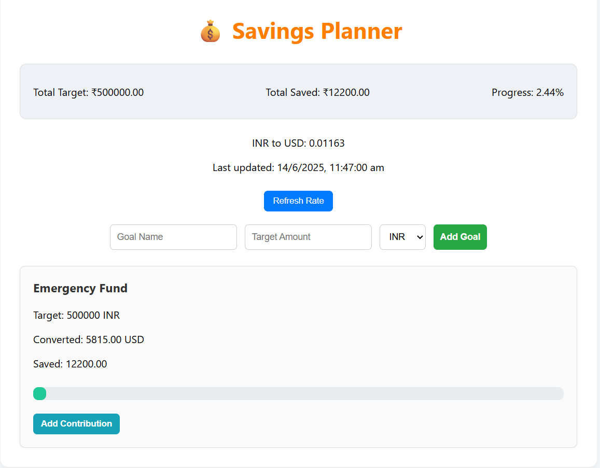

# 💰 Syfe Goal-Based Savings Planner

A lightweight, responsive savings planner built in **React + JavaScript + CSS**, designed as a take-home assignment for the Syfe Frontend Intern role.


🚀 Features

- ✅ Add multiple savings goals (e.g., "Emergency Fund - ₹50,000")
- ✅ View converted goal targets in INR/USD using live exchange rate
- ✅ Add contributions to goals and track progress
- ✅ Dashboard shows total savings, total target, and overall completion
- ✅ Fully responsive and mobile-friendly layout


 🛠 Tech Stack

- **React** (CRA setup)
- **JavaScript (ES6+)**
- **CSS (Custom – no UI libraries used)**
- [ExchangeRate API](https://app.exchangerate-api.com/) for currency conversion


📦 Installation & Local Setup

1. **Clone the Repo**
```bash
git clone https://github.com/Shukla000/Syfe-Savings-Planner.git
cd Syfe-Savings-Planner
```

2. **Install Dependencies**
```bash
npm install
```

3. **Add Your API Key**
- Sign up at [ExchangeRate-API](https://app.exchangerate-api.com)
- In `App.js`, replace:
```js
https://v6.exchangerate-api.com/v6/YOUR_API_KEY/latest/INR
```
with:
```js
https://v6.exchangerate-api.com/v6/your_real_key/latest/INR
```

4. **Run the App**
```bash
npm start
```

App runs at `http://localhost:3000`


## 🌐 Live Demo
[🔗 View Demo on Vercel](https://syfe-savings-planner-1gzflcs2a-lakshmishree-shuklas-projects.vercel.app)


📸 Screenshot




